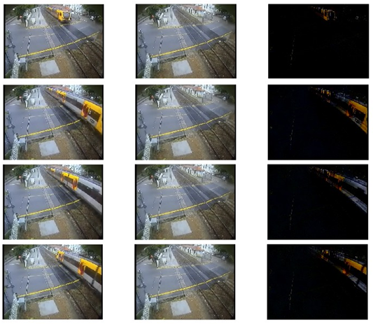

# Tensor Robust Principal Component Analysis with Convex Optimization 

This is a repository of simple TRPCA experiments including image denoising, video background modeling and multi-dimensional data analysis and most of codes are copied from [Lu Canyi's TRPCA Github Repo](https://github.com/canyilu/Tensor-Robust-Principal-Component-Analysis-TRPCA) with some adaptions.

## Usage

Use MATLAB open the subfolder `./trpca`, and run `./trpca/rgb_image_denoising_task.m`, `./trpca/video_background_modeling_task.m` and `./trpca/timeseries_tabular_data_mining_task.m` for three applications, respectively.

## Applications

There are mainly three TRPCA applications leveraged in this repo:
- RGB image denoising
- RGB video background modeling
- multi-dimensional data analysis. 

### RGB Image Denoising

### RGB Video Background Modeling

### Multi-dimensional Data Analysis

## References

There are mainly several related works about this repo:

1. Wright et al. - NeurIPS 2009 - Robust Principal Component Analysis: Exact Recovery of Corrupted Low-Rank Matrices via Convex Optimization
2. Candès et al. - JACM 2011 - Robust principal component analysis?
3. Lu et al. - CVPR 2016 - Tensor Robust Principal Component Analysis: Exact Recovery of Corrupted Low-Rank Tensors via Convex Optimization
4. Lu et al. - TPAMI 2020 - Tensor Robust Principal Component Analysis with A New Tensor Nuclear Norm

## Miscellaneous

You can refer to Lu Canyi's [personal homepage](https://canyilu.github.io/), [github homepage](https://github.com/canyilu) and [google scholar homepage](https://scholar.google.com/citations?user=EZcKJi4AAAAJ&hl=en) to find more related and interesting works about various mathematics theorm applied to Computer Science.