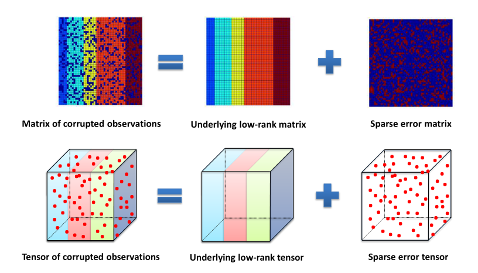

# Tensor Principal Component Analysis with Convex Optimization 

This is a repository of improvements, adaptions and main applications of trpca series works.

## Improvements and Adaptions

Coming soon...

## Main Applications

Coming soon...

## References

There are several related works envolved in this repo:

1. Wright et al. - NeurIPS 2009 - Robust Principal Component Analysis: Exact Recovery of Corrupted Low-Rank Matrices via Convex Optimization
2. Candès et al. - JACM 2011 - Robust principal component analysis?
3. Lu et al. - TPAMI 2015 - A Unified Alternating Direction Method of Multipliers by Majorization Minimization
4. Lu et al. - CVPR 2016 - Tensor Robust Principal Component Analysis: Exact Recovery of Corrupted Low-Rank Tensors via Convex Optimization
5. Lu et al. - IJCAI 2018 - Exact Low Tubal Rank Tensor Recovery from Gaussian Measurements
6. Lu et al. - CVPR 2019 - Low-Rank Tensor Completion With a New Tensor Nuclear Norm Induced by Invertible Linear Transforms
7. Lu et al. - TPAMI 2020 - Tensor Robust Principal Component Analysis with A New Tensor Nuclear Norm

## Miscellaneous

You can refer to Lu Canyi's [personal homepage](https://canyilu.github.io/), [github homepage](https://github.com/canyilu) and [google scholar homepage](https://scholar.google.com/citations?user=EZcKJi4AAAAJ&hl=en) to find more related and interesting works about various mathematics theorm applied to Computer Science.